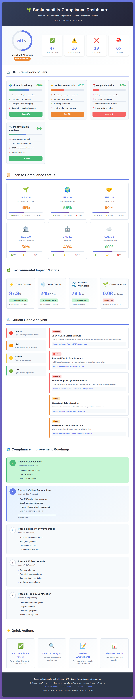
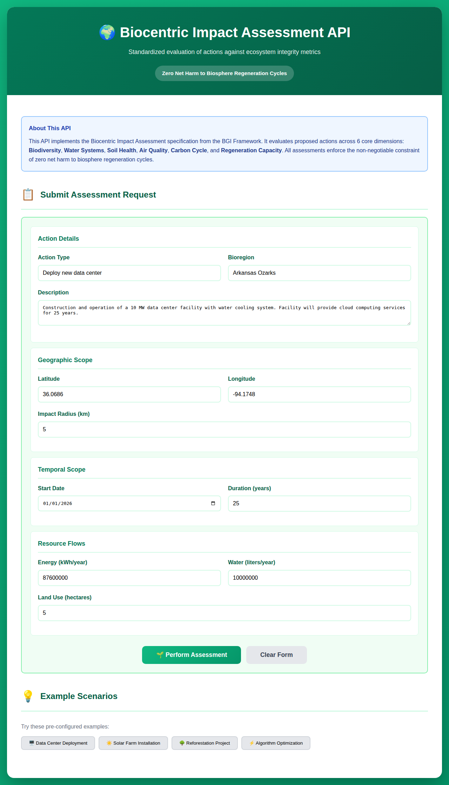

# DAC

Decentralized Autonomous Communities

## Overview

DAC (Decentralized Autonomous Communities) is a project focused on building sustainable, ethical, and community-governed technology systems. We believe that software licensing should go beyond intellectual property rights to embed commitments to environmental sustainability, social responsibility, and ethical governance.

## BGINexus.io Sustainability Licenses

This repository hosts six innovative sustainability-focused software licenses developed for BGINexus.io:

### 🌱 [Sustainable Use License (SUL-1.0)](./licenses/SUL-1.0.md)

Focuses on energy efficiency, resource optimization, and minimizing environmental footprint.

### 🌍 [Environmental Impact License (EIL-1.0)](./licenses/EIL-1.0.md)

Requires comprehensive environmental lifecycle assessment and mitigation measures.

### 🤝 [Social Benefit License (SBL-1.0)](./licenses/SBL-1.0.md)

Ensures software serves the public good with emphasis on accessibility, equity, and inclusion.

### 🏛️ [Community Governance License (CGL-1.0)](./licenses/CGL-1.0.md)

Establishes democratic, transparent, and inclusive project governance requirements.

### 🤖 [Ethical AI License (EAL-1.0)](./licenses/EAL-1.0.md)

Comprehensive ethical requirements for AI/ML systems covering fairness, transparency, and accountability.

### ☁️ [Climate Accountability License (CAL-1.0)](./licenses/CAL-1.0.md)

Rigorous climate impact measurement, reporting, and reduction aligned with Paris Agreement goals.

## Learn More

Visit the [licenses directory](./licenses/) for:

- Full license texts
- Detailed implementation guidance
- Comparison table and use cases
- Compliance requirements

## BGI Alignment Framework

For technical specifications and implementations of the Beneficial AGI (BGI) Alignment Framework, see the [BGI Framework documentation](./bgi-framework/README.md).

The BGI Framework provides concrete technical standards for building AGI systems that prioritize biocentric values, sapient partnership, and temporal fidelity with biological rhythms.

### BGI Compliance Resources

The project includes comprehensive resources for verifying BGI Framework alignment:

- **[License Alignment Matrix](./bgi-framework/BGI-License-Alignment-Matrix.md)**: Detailed mapping of how each sustainability license aligns with BGI Framework principles
- **[Gap Analysis](./bgi-framework/BGI-Gap-Analysis.md)**: Identification of gaps between current licenses and full BGI Framework requirements
- **[Compliance Checklist](./bgi-framework/BGI-Compliance-Checklist.md)**: Practical verification checklist for developers and organizations
- **[License Amendments](./bgi-framework/BGI-License-Amendments.md)**: Proposed enhancements to strengthen BGI alignment

Current licenses provide ~50% coverage of BGI Framework requirements. The compliance resources identify gaps and provide roadmap for enhanced alignment.

## 📊 Compliance Dashboard

Interactive dashboard for real-time BGI Framework alignment and license compliance tracking:

**[View Live Compliance Dashboard](https://violet-site-systems.github.io/DAC/compliance-dashboard.html)**

The dashboard provides:

- **Overall BGI Alignment Score**: Current 50% compliance with target of 85%
- **BGI Framework Pillars**: Detailed breakdown across Biocentric Primacy, Sapient Partnership, Temporal Fidelity, and Implementation Mandates
- **License-by-License Status**: Individual compliance scores for all six sustainability licenses (SUL, EIL, SBL, CGL, EAL, CAL)
- **Environmental Metrics**: Real-time tracking of energy efficiency, carbon footprint, resource optimization, and ecosystem impact
- **Critical Gaps Analysis**: Identification of 19 gaps categorized by priority (5 critical, 6 high, 7 medium, 1 low)
- **Improvement Roadmap**: 4-phase plan to reach 85%+ alignment over 12 months



## 🌍 Biocentric Impact Assessment API

Evaluate decisions and actions against ecosystem integrity metrics with the **[Biocentric Impact Assessment API](./bgi-framework/biocentric-impact-api.md)**:

**[Try Interactive Demo](./bgi-framework/biocentric-impact-api-example.html)**

This API implements the core BGI Framework principle of **Biocentric Primacy**: zero net harm to biosphere regeneration cycles. It provides:

- **Multi-dimensional Impact Scoring**: Evaluate actions across 6 core dimensions (Biodiversity, Water Systems, Soil Health, Air Quality, Carbon Cycle, and Regeneration Capacity)
- **Bioregional Data Integration**: Context-aware assessments tied to specific ecosystems
- **Real-time Monitoring**: Track actual vs. predicted impacts
- **Mitigation Requirements**: Automatic calculation of measures needed to achieve zero net harm
- **Three-Tier Consent Integration**: Serves as Tier 1 in the comprehensive consent architecture

The API enforces non-negotiable ecological constraints before any action proceeds, ensuring technology development prioritizes ecosystem health.



## 🤖 Agent Framework

The DAC project includes an experimental agent framework (`/agents`) that demonstrates AI-powered agent capabilities for decentralized autonomous systems.

### ASI:One (@Aethel) Integration

**⚠️ For Internal Development & Testing Only**

The agent framework includes integration with ASI:One AI services (asi1.ai) via the `AethelAgent` class. This integration is designed for:

- **Internal development and testing** of AI-powered agent capabilities
- **Proof-of-concept demonstrations** of multi-agent orchestration
- **Research and experimentation** with AI governance patterns

**Important Notes:**
- The Aethel integration requires API credentials that are **not publicly available**
- CI/CD workflows that test Aethel integration will **skip gracefully on fork PRs** without API access
- This is **not intended for production use** in its current form
- See `/agents/docs/AETHEL_INTEGRATION.md` for technical details and usage guidance

For more information about the agent framework architecture and capabilities, see the [Agent Framework README](/agents/README.md).

## DAO Guide Agent

Need help creating your DAO? Our AI-powered [DAO Guide Agent](https://chakra-ai.io/agent/ded78833-31ec-442b-84b6-c123c107ba64/modify) assists with DAO creation and AI governance.

This intelligent assistant helps you:

- Design and structure your Decentralized Autonomous Organization
- Navigate DAO governance frameworks
- Implement AI-powered governance systems
- Ensure alignment with community governance principles

## 🚀 DAC Node Setup

This repository provides the DAC framework documentation, governance principles, and sustainability licenses. To set up your own DAC node with smart contracts, you'll need to create a separate blockchain project following these instructions.

Setting up a Decentralized Autonomous Community (DAC) node involves deploying smart contracts and configuring a local or cloud-based environment to participate in community governance.

### Prerequisites

Before you begin, ensure you have the following installed:

- **Node.js** (v18+ recommended)
- **Package Manager**: npm or yarn
- **Blockchain Development Framework**: [Hardhat](https://hardhat.org/) or [Foundry](https://github.com/foundry-rs/foundry) for contract compilation and testing

### Step 1: Environment Preparation

Ensure you have Node.js v18 or higher installed:

```bash
# Verify Node.js installation
node --version

# Verify npm installation
npm --version
```

You can download Node.js from [nodejs.org](https://nodejs.org/) if not already installed.

For contract compilation, we'll use Hardhat (installed in Step 2). Alternatively, you can use [Foundry](https://github.com/foundry-rs/foundry):

```bash
# Optional: Install Foundry (Rust-based alternative to Hardhat)
curl -L https://foundry.paradigm.xyz | bash
foundryup
```

### Step 2: Project Setup

Create a new directory for your DAC node project and initialize it:

```bash
# Create a new project directory
mkdir my-dac-node
cd my-dac-node

# Initialize a new Node.js project
npm init -y

# Install Hardhat as a dev dependency
npm install --save-dev hardhat

# Initialize Hardhat project
npx hardhat init
```

When prompted, select "Create a JavaScript project" or "Create a TypeScript project" based on your preference.

### Step 3: Configuration

Create and configure your environment variables:

1. **Create .env file** in your project root:

```bash
touch .env
```

2. **Add the following configuration** to your `.env` file:

```plaintext
# Private key for contract deployment (NEVER commit this!)
PRIVATE_KEY=your_private_key_here

# Provider URL (Infura, Alchemy, or other Web3 provider)
# Use testnet for testing (e.g., Sepolia), mainnet for production
PROVIDER_URL=https://sepolia.infura.io/v3/YOUR_INFURA_PROJECT_ID

# API Keys for block explorers (e.g., Etherscan)
ETHERSCAN_API_KEY=your_etherscan_api_key_here

# Network configuration
NETWORK=sepolia  # or localhost for testing, mainnet for production
```

**Security Note**: Never commit your `.env` file or share your private keys. Ensure `.env` is listed in `.gitignore`.

### Step 4: Local Node Deployment (Optional - For Testing)

For local testing and development, you can run a local blockchain node:

```bash
# Start a local Hardhat node
npx hardhat node
```

This will start a local blockchain at `http://localhost:8545`. Configure your wallet (e.g., MetaMask) to connect to this local RPC URL.

**MetaMask Configuration**:
1. Open MetaMask
2. Click on the network dropdown
3. Select "Add Network"
4. Enter the following details:
   - Network Name: Hardhat Local
   - RPC URL: `http://localhost:8545`
   - Chain ID: `31337`
   - Currency Symbol: `ETH`

### Step 5: Smart Contract Development and Deployment

First, create your governance contracts. You can use templates from existing DAO frameworks or create custom contracts. Then deploy them:

```bash
# Example: Deploy your governance contracts to local network
npx hardhat run scripts/deploy.js --network localhost

# Deploy to testnet (e.g., Sepolia) for testing
npx hardhat run scripts/deploy.js --network sepolia

# Deploy to mainnet (use with caution and after thorough testing)
npx hardhat run scripts/deploy.js --network mainnet
```

**Note**: You'll need to create your deployment scripts in the `scripts/` directory. Since this is a BGINexus.io project affiliated with the SingularityNET Foundation, refer to these resources for contract templates:
- [SingularityNET Platform Contracts](https://github.com/singnet/platform-contracts) - Smart contracts for the SingularityNET decentralized AI marketplace and governance
- [Cudos Network CosmWasm Contracts](https://github.com/CudoVentures/cudos-example-smart-contracts) - Example smart contracts for Cosmos-based governance on Cudos

After deployment, save the contract addresses displayed in the console. You'll need these addresses to interact with your DAC node.

### Step 6: Verify Deployment

Verify your contracts on Etherscan (for testnets and mainnet):

```bash
# Example: Verify a contract with constructor arguments
npx hardhat verify --network <network_name> <CONTRACT_ADDRESS> "Constructor Arg 1" "Constructor Arg 2"

# Example without constructor arguments
npx hardhat verify --network sepolia 0x1234567890123456789012345678901234567890
```

**Note**: Replace `<network_name>` with your target network (e.g., `sepolia`, `mainnet`) and `<CONTRACT_ADDRESS>` with your deployed contract address. Include constructor arguments in the same order and format as used during deployment.

### Post-Deployment

Once your DAC node is deployed:

1. **Configure Governance Parameters**: Set up voting mechanisms, proposal thresholds, and other governance rules
2. **Invite Community Members**: Share contract addresses and participation guidelines
3. **Monitor Node Health**: Regularly check node status and community activity
4. **Participate in Governance**: Engage in proposal creation and voting

### Troubleshooting

Common issues and solutions:

- **"Insufficient funds" error**: Ensure your wallet has enough ETH for gas fees
- **"Network connection failed"**: Verify your provider URL and network configuration
- **"Contract deployment failed"**: Check your contract code for errors and ensure all dependencies are installed

### Additional Resources

- [Hardhat Documentation](https://hardhat.org/getting-started/)
- [Building a DAO Tutorial](https://github.com/LearnWeb3DAO/Building-a-DAO)
- [SingularityNET Platform Contracts](https://github.com/singnet/platform-contracts) - Official SingularityNET smart contracts
- [Cudos Network Documentation](https://github.com/CudoVentures/cudos-docs) - Cudos blockchain documentation
- [Web3.js Documentation](https://web3js.readthedocs.io/)
- [Ethers.js Documentation](https://docs.ethers.io/)

For more assistance with DAO creation and governance, visit our [DAO Guide Agent](https://chakra-ai.io/agent/ded78833-31ec-442b-84b6-c123c107ba64/modify).

## Contributing

We welcome contributions, feedback, and suggestions for improving these licenses. Please open an issue or submit a pull request.

## License

The license texts are released under CC0 1.0 Universal (public domain) to enable widespread adoption.

---

This project is a H+AI Partnership between GitHub Copilot and Colleen Pridemore
